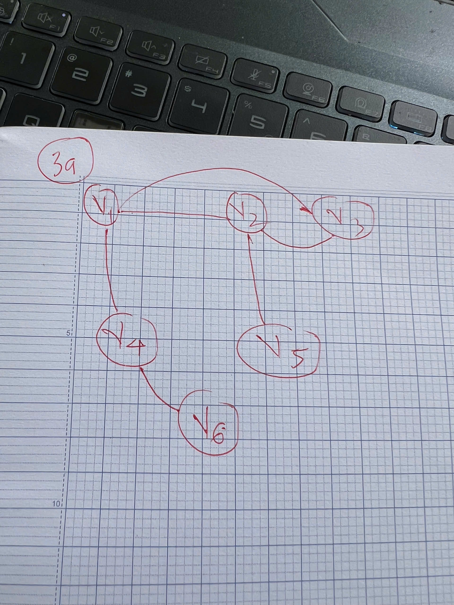
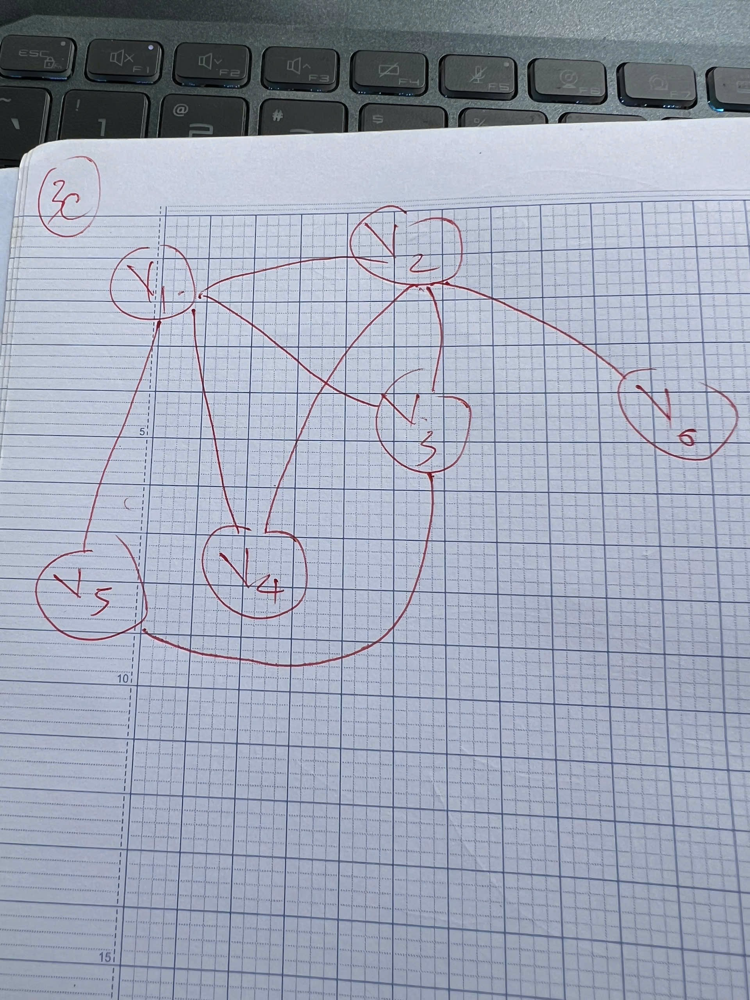
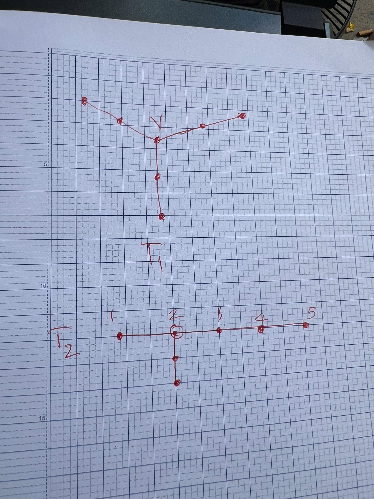

# Homework 5

## Bài 1

- Tập \(A = \{11, 13, 15, 17,\ldots,\}\) là những số tự nhiên lẻ và lớn 11.

- Ta nhận thấy, mỗi phần tử trong tập hợp \(A\) có dạng là \(2n + 11\) với \(n \in \mathbb{N}\) (số tự nhiên).

- Với \(\mathbb{N} = \{0, 1, 2, 3, \ldots\}\), ta có thể định nghĩa một hàm \(f: \mathbb{N} \to A\) như sau: \(f(n) = 2n + 11\).

- Hàm \(f\) này là một song ánh (bijection) vì:

  - **Đơn ánh (injective)**: Nếu \(f(n_1) = f(n_2)\), thì \(2n_1 + 11 = 2n_2 + 11\) dẫn đến \(n_1 = n_2\).

  - **Toàn ánh (surjective)**: Với mọi phần tử \(a \in A\), ta có thể tìm được \(n \in \mathbb{N}\) sao cho \(f(n) = a\). Cụ thể, nếu \(a\) là một phần tử của \(A\), thì \(a = 2n + 11\), suy ra: \(n = \frac{a - 11}{2}\). Vì \(a\) là số lẻ lớn hơn hoặc bằng 11, nên \(n\) sẽ là một số tự nhiên.

- Do đó, hàm \(f\) là một song ánh giữa \(\mathbb{N}\) và \(A\), chứng tỏ rằng tập \(A\) có cùng số phần tử với tập \(\mathbb{N}\).

## Bài 2

- Vì \(A, B\) là 2 tập hợp rời nhau, nên ta có thể chọn \(A\) là tập hợp các số lẻ và \(B\) là tập hợp các số chẵn.

- Giả sử \(N=\{0, 1, 2, 3, \ldots\}\) là tập hợp các số tự nhiên.

- Ta định nghĩa hàm số: 
  \[
  f(n) = \begin{cases}
    2n + 1 & \text{nếu } n \in A \\
    2n & \text{nếu } n \in B
  \end{cases}
  \]

- Chứng minh \(f(n)\) là đơn ánh:

    - Nếu \(f(n_1) = f(n_2)\) và \(n_1, n_2 \in A\), thì \(2n_1 + 1 = 2n_2 + 1\) dẫn đến \(n_1 = n_2\).
    
    - Nếu \(f(n_1) = f(n_2)\) và \(n_1, n_2 \in B\), thì \(2n_1 = 2n_2\) dẫn đến \(n_1 = n_2\).
    
    - Nếu \(f(n_1) = f(n_2)\) và \(n_1 \in A, n_2 \in B\), thì \(2n_1 + 1 = 2n_2\) dẫn đến mâu thuẫn vì \(2n_1 + 1\) là số lẻ còn \(2n_2\) là số chẵn.

- Chứng minh \(f(n)\) là toàn ánh:

    - Với mọi phần tử \(a \in A\), ta có thể tìm được \(n \in N\) sao cho \(f(n) = a\). Cụ thể, nếu \(a\) là một phần tử của \(A\), thì \(a = 2n + 1\), suy ra: \(n = \frac{a - 1}{2}\). Vì \(a\) là số lẻ, nên \(n\) sẽ là một số tự nhiên.

    - Với mọi phần tử \(b \in B\), ta có thể tìm được \(n \in N\) sao cho \(f(n) = b\). Cụ thể, nếu \(b\) là một phần tử của \(B\), thì \(b = 2n\), suy ra: \(n = \frac{b}{2}\). Vì \(b\) là số chẵn, nên \(n\) sẽ là một số tự nhiên.

- Do đó, hàm \(f\) là một song ánh giữa \(N\) và \(A \cup B\).

## Bài 3

a) Dãy bậc \((3, 3, 2, 2, 1, 1)\)

- Tổng bậc: \(3 + 3 + 2 + 2 + 1 + 1 = 12\) là một số chẵn.
- Số đỉnh bậc lẻ: Có 4 đỉnh bậc lẻ (3, 3, 1, 1) là một số chẵn.
- Bậc cao nhất là bậc 3, thỏa điều kiện \(3 \leq 6 - 1 = 5\).
- Vẽ đồ thị đơn:

b) Dãy bậc \((5, 3, 3, 2, 1, 0)\)
- Tổng có 6 đỉnh, mà có 1 đỉnh là bậc 5, có nghĩa là đỉnh này sẽ nối với tất cả các đỉnh còn lại. Nhưng có 1 đỉnh bậc 0, không nối với đỉnh nào. Dẫn đến mâu thuẫn, nên dãy bậc này không phải là dãy bậc của một đồ thị đơn.

c) Dãy bậc \((4, 4, 3, 2, 2, 1)\)

- Tổng bậc: \(4 + 4 + 3 + 2 + 2 + 1 = 16\) là một số chẵn.

- Số đỉnh bậc lẻ: Có 2 đỉnh bậc lẻ (3, 1) là một số chẵn.

- Bậc cao nhất là bậc 4, thỏa điều kiện \(4 \leq 6 - 1 = 5\).

## Câu 4

a) Đồ thị có 8 đỉnh, nên đường đi dài nhất đi qua 7 cạnh, mỗi đỉnh đi qua đúng một lần. Ta có 1 đường đi dài nhất là: \(d \to a \to c \to b \to e \to h \to f \to g\). Độ dài của đường đi này là 7.

b) Chu trình Hamilton là một đường đi qua tất cả các đỉnh của đồ thị đúng một lần và trở về điểm xuất phát. Ta có một chu trình Hamilton là: \(a \to d \to g \to h \to e \to b \to f \to c \to a\).

c) Đường đi Euler là một đường đi qua tất cả các cạnh của đồ thị đúng một lần.

- Đỉnh a có bậc 3 (lẻ)

- Đỉnh b có bậc 4 (chẵn)

- Đỉnh c có bậc 4 (chẵn)

- Đỉnh d có bậc 3 (lẻ)

- Đỉnh e có bậc 3 (lẻ)

- Đỉnh f có bậc 4 (chẵn)

- Đỉnh g có bậc 4 (chẵn)

- Đỉnh h có bậc 3 (lẻ)

- Vì có 4 đỉnh có bậc lẻ (a, d, e, h), nên đồ thị này không có đường đi Euler.

## Câu 5

a) Các cây không có đẳng cấu (Nonisomorphic), có đúng 7 đỉnh: là 11 cây. Dạng đường thằng \(P_7\) và dạng hình sao \(K_{1,6}\) và các dạng phân nhánh khác.

b) Xét 2 cây có cùng dãy bậc (3, 2, 2, 1, 1, 1, 1). Ta có thể vẽ được 2 cây khác nhau như sau:

- Cả 2 cây cùng có dãy bậc: 1 đỉnh bậc 3, 3 đỉnh bậc 2, và 3 đỉnh bậc 1.

- Không đẳng cấu: Trong cây 1, đỉnh bậc 3 nối với 3 đỉnh bậc 2. Trong cây 2, đỉnh bậc 3 chỉ được nối với 1 đỉnh bậc 2 và 2 đỉnh bậc 1.

## Câu 6

- Xác định "Bồ câu" và "Chuồng" để áp dụng nguyên lý "Chuồng bô câu":

    - "Bồ câu" là các đỉnh của đồ thị. Giả sử có \(n\) đỉnh với (\(n\geq 2\)).
    - "Chuồng" là các giá trị bậc khả thi mà đỉnh có thể nhận được.

- Trong 1 đồ thị đơn có \(n\) đỉnh:

    - Bậc nhỏ nhất là 0 và bậc lớn nhất là \(n-1\).

    - Do đó, các giá trị bậc khả thi là: \(0, 1, 2, \ldots, n-1\), có đúng \(n\) giá trị.

    - Trong 1 đồ thị củ thể, không thể cùng xuất hiện 2 bậc là 0 và \(n-1\) vì nếu có đỉnh bậc \(n-1\) thì tất cả các đỉnh khác phải có bậc ít nhất là 1, dẫn đến mâu thuẫn với việc có đỉnh bậc 0.

    - Với việc loại bỏ 1 trong 2 bậc (0 hoặc \(n-1\)), ta chỉ còn lại \(n-1\) giá trị bậc khả thi, rơi vào 2 trường hợp:

        - Trường hợp 1: Nếu có đỉnh bậc 0, thì các giá trị bậc khả thi là \(1, 2, \ldots, n-1\) (tổng cộng \(n-1\) giá trị).

        - Trường hợp 2: Nếu có đỉnh bậc \(n-1\), thì các giá trị bậc khả thi là \(0, 1, 2, \ldots, n-2\) (tổng cộng \(n-1\) giá trị).

    - Chúng ta có \(n\) đỉnh (bồ câu) nhưng chỉ có \(n-1\) giá trị bậc khả thi (chuồng), nên theo nguyên lý "Chuồng bô câu", ít nhất phải có 2 đỉnh có cùng bậc.

## Câu 7

- Chứng minh đồ thị có ít nhất \(k +1\) đỉnh:

    - Giả sử bậc của định \(v\) tối thiểu là \(k\).

    - Trong đồ thị đơn, một đỉnh có thể nối với các đỉnh khác và không có đa cạnh.

    - Để đỉnh \(v\) có bậc \(k\), nó phải nối với ít nhất \(k\) đỉnh khác.

    - Nên tổng số đỉnh \(n\) phải lớn hơn hoặc bằng \(k + 1\) (đỉnh \(v\) cộng với ít nhất \(k\) đỉnh khác).

- Chứng minh đồ thị có ít nhất \(\dfrac{k(k + 1)}{2}\) cạnh:

    - Tổng bậc của tất cả các đỉnh bằng 2 lần số cạnh.

    - Gọi \(n\) là số đỉnh của đồ thị, có có: \(n \geq k + 1\).

    - Tổng số bậc sẽ là: \(n \cdot k\) (vì mỗi đỉnh có bậc tối thiểu là \(k\)).

    - Ta có: \(n \cdot k \leq 2E\) (vì tổng bậc bằng 2 lần số cạnh).
    - Thay \(n \geq k + 1\) vào, ta có: \((k + 1) \cdot k \leq 2E\).
    - Suy ra: \(E \geq \dfrac{k(k + 1)}{2}\).
    